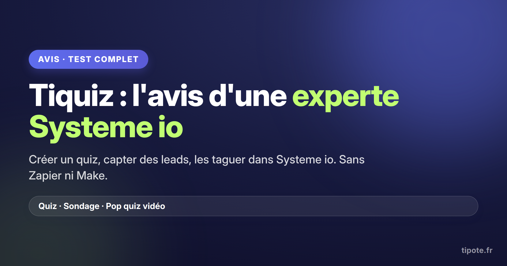
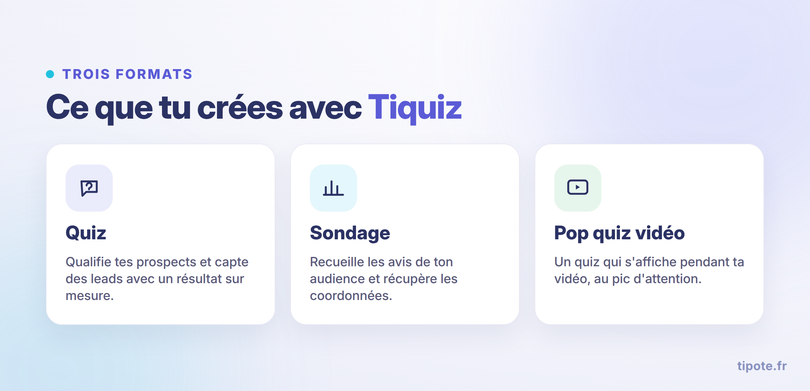
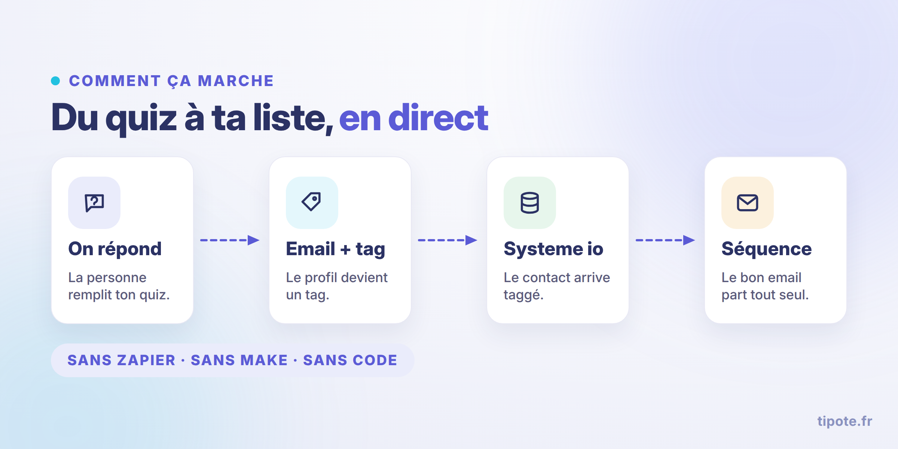
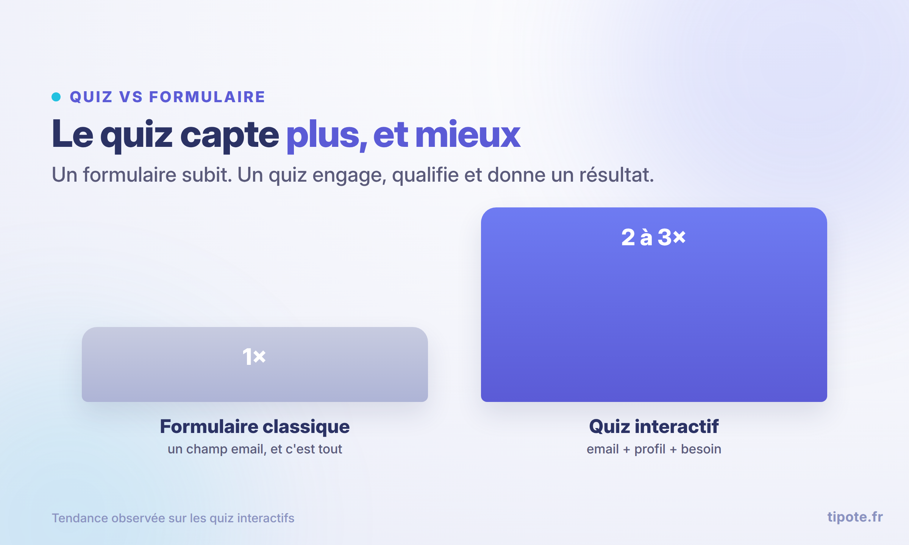
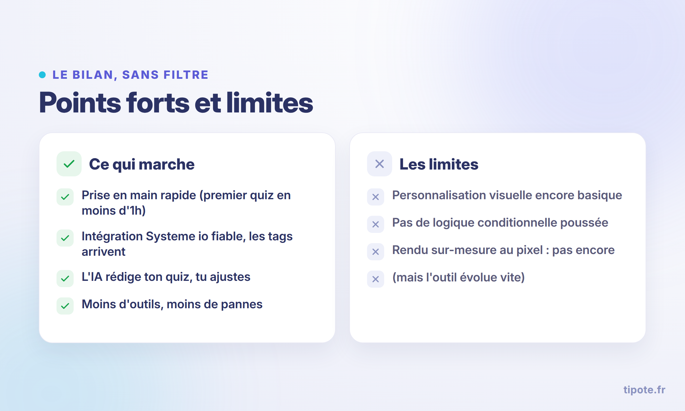

<!--
=========================================================
À COLLER DANS SYSTEME IO (champs SEO du blog)
=========================================================
Titre SEO : Tiquiz : l'avis d'une experte Systeme io (test complet en vidéo)

Chemin d'URL (slug) : tiquiz-avis
URL complète : https://www.tipote.fr/tiquiz-avis

Meta description :
Tiquiz tient-il ses promesses sur Systeme io ? Le test d'une experte en vidéo, des résultats clients concrets et les vraies limites. Quiz, leads et tags sans Zapier.

Mots clés SEO (à coller tels quels, séparés par des virgules) :
tiquiz, tiquiz avis, avis tiquiz, tiquiz systeme io, quiz systeme io, créer un quiz systeme io, outil quiz systeme io, quiz lead magnet, collecter des leads systeme io, quiz sans zapier, sondage systeme io, pop quiz vidéo, segmenter ses contacts systeme io, tags systeme io, générer des leads

Texte pour la vignette du blog (accroche courte) :
Tiquiz, ça vaut le coup ? Le test complet d'une experte Systeme io : quiz, leads et tags, sans Zapier.

EMBED VIDÉO : colle le lecteur YouTube (https://youtu.be/9WcPdPtahUo) à l'endroit marqué "EMBED VIDÉO".
DONNÉES STRUCTURÉES : ajoute le fichier tiquiz-avis-faq.json (FAQ schema) dans un bloc <script type="application/ld+json"> pour viser les questions dans Google.

IMAGES (5 PNG livrés, charte Tipote) : uploade-les dans ton blog puis remplace le nom de fichier par l'URL fournie par Systeme io. Les textes alt sont déjà écrits (garde-les, ils aident le SEO image). Utilise tiquiz-avis-cover.png en image à la une (og:image).
=========================================================
-->

**TL;DR :** **Tiquiz** crée des **quiz**, des **sondages** et des **pop quiz vidéo** connectés à **Systeme io**. Les **leads** arrivent taggés automatiquement, **sans Zapier ni Make**. La **version gratuite** (sans carte bleue, sans limite de durée) suffit pour tout tester, et le premier quiz se monte en moins d'une heure. Ses limites : la personnalisation visuelle et la logique conditionnelle restent basiques.

# Tiquiz : l'avis d'une experte Systeme io (test complet en vidéo)

**Tiquiz** crée un **quiz**, récupère les **leads** et les range dans **Systeme io** avec le bon **tag**, **sans Zapier ni Make**. C'est précisément ce que Systeme io ne fait pas tout seul.

Je développe Tiquiz. Donc mon avis, tu peux t'en méfier. Le mieux, c'est de regarder ceux qui l'utilisent sans avoir de raison de le vendre. On commence par Christelle.

## L'avis de Christelle en vidéo

Christelle accompagne les coachs, thérapeutes et formateurs sur **Systeme io**. Elle a monté son premier **quiz** en moins d'une heure, connexion comprise, et elle déroule tout à l'écran : la création, les **tags**, le passage dans Systeme io, jusqu'aux endroits qui coincent.

<!-- EMBED VIDÉO YOUTUBE ICI : https://youtu.be/9WcPdPtahUo -->

Son résumé : l'outil fait le job, et il fait gagner un temps fou.

## Tiquiz, c'est quoi

**Tiquiz** sert à créer trois formats : des **quiz**, des **sondages** et des **pop quiz vidéo** (un quiz qui s'affiche pendant une vidéo).

L'objectif n'est pas de divertir. C'est de **qualifier tes prospects** et de récupérer des **leads** mieux qu'avec un formulaire.

Le point clé quand tu es sur **Systeme io** : l'intégration est native. Quelqu'un répond, son email arrive dans Systeme io avec le **tag** que tu as choisi, et tu enchaînes avec la bonne séquence email. Pas de **Zapier**, pas de **Make**, pas de tuyauterie entre dix outils.

Le pas à pas complet est ici : [comment créer un quiz sur Systeme io](https://www.tipote.fr/comment-creer-quiz-systeme-io).

## Ce que Tiquiz fait bien

**Prise en main rapide.** Un premier **quiz** en ligne en moins d'une heure, même sans être à l'aise avec la technique.

**L'intégration Systeme io est fiable.** Les **tags** arrivent, aucun contact perdu, aucun délai. C'est le nerf de l'outil, et c'est solide.

**L'IA rédige ton quiz.** Tu donnes ton objectif et ta cible, elle propose une première version, tu ajustes en cliquant. Des heures de rédaction en moins.

**Moins d'outils dans ta chaîne.** Moins de réglages, moins de pannes possibles, une mise en ligne directe.

Le format joue aussi : un **quiz** convertit en général bien mieux qu'un formulaire, comme le montrent les [données de conversion d'Interact](https://www.tryinteract.com/blog/quiz-conversion-rate-report/). Un quiz, c'est un **lead magnet** vivant, à l'inverse du PDF qu'on télécharge et qu'on oublie ([d'autres idées de lead magnets](https://systeme.io/fr/blog/exemples-lead-magnets)).

## Ce qu'en disent les utilisateurs

Christelle n'est pas la seule à l'avoir mis entre les mains. Quelques retours d'utilisateurs sur **Systeme io** :

Sébastien met de la publicité sur un tunnel construit avec un **quiz** : **« j'ai divisé mon coût par lead par 2 »**.

Une autre cliente, partie d'un compte tout neuf, a récupéré **680 nouveaux contacts en un mois**, uniquement avec son quiz.

Une participante a repéré, grâce au suivi question par question, que sa question 2 faisait fuir du monde. Elle a inversé deux questions et **son taux de complétion a grimpé**, sans un visiteur de plus.

Le point commun : ce n'est pas l'outil seul qui fait le résultat, c'est le quiz bien construit et bien branché.

## Les limites de Tiquiz

Deux choses manquent aujourd'hui.

**La personnalisation visuelle.** Couleurs, logo, police : tu as la main. Un rendu sur-mesure au pixel pour une charte très pointue : pas encore.

**La logique conditionnelle poussée.** Des parcours à multiples branches selon chaque réponse, ce n'est pas le terrain de Tiquiz pour l'instant.

L'outil évolue vite, donc ces deux points peuvent bouger dans les prochains mois.

## Tiquiz gratuit ou payant

Commence par le **gratuit**.

La **version gratuite** te laisse créer ton premier **quiz**, le connecter à **Systeme io** et le publier. **Sans carte bleue, sans limite de durée.**

Le **payant** lève les plafonds : plus de réponses, plus de projets, ton domaine personnalisé, et la mention Tiquiz qui disparaît (rendu plus pro).

Le bon ordre : tu testes en gratuit, tu vérifies que ça te ramène des leads, tu passes au payant ensuite.

## Tiquiz, c'est pour qui

Pour toi si tu es coach, thérapeute, formateur ou consultant sur **Systeme io**, et que tu veux capter et **segmenter** tes contacts sans y passer tes journées.

Moins pour toi si tu as des besoins très techniques, une charte à respecter au millimètre, ou des parcours conditionnels complexes.

Pour l'immense majorité des solopreneurs sur Systeme io, il fait le travail.

## Un quiz ne rapporte pas tout seul

Tiquiz crée le **quiz**. C'est déjà beaucoup. Mais un quiz en ligne ne remplit pas ta liste par magie.

Amener du trafic dessus, trier tes **leads**, les relancer, vendre : c'est une méthode, pas une fonctionnalité.

C'est pour ça que j'ai monté **[l'Atelier du Quiz](https://www.tipote.fr/atelier-du-quiz)** : 7 jours pour installer tout le système autour de ton quiz. Le plan de trafic gratuit, les séquences email prêtes à coller, un coach dispo jour et nuit, et l'accès Tiquiz gratuit inclus.

Tiquiz te donne l'outil. L'Atelier te donne le système qui le rend rentable.

## Ce que ça vaut, au final

Si tu es sur **Systeme io** et que tu veux du simple qui fonctionne, Tiquiz coche les cases.

Il crée tes **quiz**, sondages et pop quiz vidéo, capte tes **leads** et les range dans Systeme io avec le bon **tag**. Son vrai atout, c'est la simplicité : peu de réglages, une mise en ligne rapide, et un **gratuit** qui te laisse tout essayer avant de payer.

👉 [Je teste Tiquiz gratuitement](https://www.tipote.fr/tiquiz)

Pour le système complet autour, pas seulement l'outil : 👉 [je rejoins l'Atelier du Quiz](https://www.tipote.fr/atelier-du-quiz).

## FAQ

**Tiquiz est-il vraiment gratuit, ou y a-t-il un piège ?**
La version gratuite est réellement gratuite : tu crées ton premier quiz, tu le connectes à Systeme io et tu le publies, sans carte bleue et sans limite de durée. Tu ne paies que le jour où tu veux plus de volume, plus de projets ou ton domaine personnalisé. Autrement dit, tu peux valider que ça te ramène des leads avant de dépenser un centime.

**Est-ce que mes contacts arrivent bien dans Systeme io, avec le bon tag ?**
Oui, c'est le cœur de l'outil. L'intégration est native : dès qu'une personne répond, son email part dans Systeme io avec le tag que tu as défini, sans Zapier ni Make. Tu peux ensuite déclencher la séquence email adaptée à son profil. Dans les tests, les tags arrivent sans délai ni contact perdu.

**Je ne suis pas du tout technique, je vais galérer ?**
Non. Il n'y a rien à coder. L'IA rédige une première version de ton quiz à partir de ton objectif, tu ajustes en cliquant, et la connexion à Systeme io est guidée étape par étape. La plupart des utilisateurs montent leur premier quiz en moins d'une heure.

**Un quiz convertit-il vraiment mieux qu'un formulaire classique ?**
En général, oui, et de loin. Un quiz engage la personne, la fait répondre, et lui donne un résultat utile en échange de son email. Tu récupères un contact plus qualifié qu'avec un simple champ email, parce que tu sais qui il est et ce qu'il veut. Les rapports de conversion sur les quiz interactifs le confirment année après année.

**Puis-je le mettre à ma marque ?**
En partie. Tu règles tes couleurs, ton logo et ta police, et le rendu est propre. Par contre, si tu as une charte graphique très pointue et que tu veux un design sur-mesure au pixel, tu sentiras des limites aujourd'hui. C'est un point que l'outil améliore régulièrement.

**Quelle différence entre Tiquiz et l'Atelier du Quiz ?**
Tiquiz est l'outil qui crée le quiz. L'Atelier du Quiz est la méthode en 7 jours pour construire tout le système autour : amener du trafic, trier les leads, les relancer et vendre. L'un ne remplace pas l'autre. L'Atelier inclut d'ailleurs l'accès Tiquiz gratuit, donc tu peux commencer sans rien payer de plus.

**Est-ce que Tiquiz fait aussi des sondages et des quiz sur vidéo ?**
Oui. En plus des quiz, tu peux créer des sondages pour recueillir des avis, et des pop quiz vidéo, c'est-à-dire un quiz qui s'affiche pendant ta vidéo YouTube pour capter des leads au moment où l'attention est au maximum.
